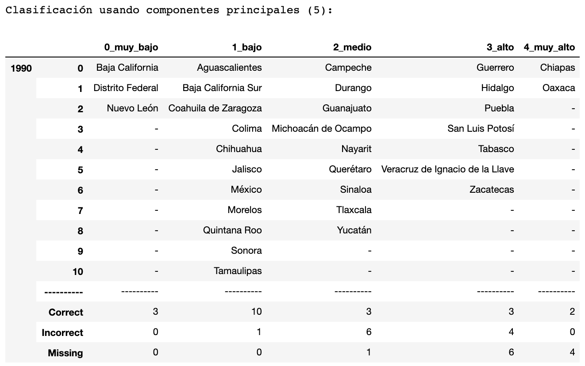
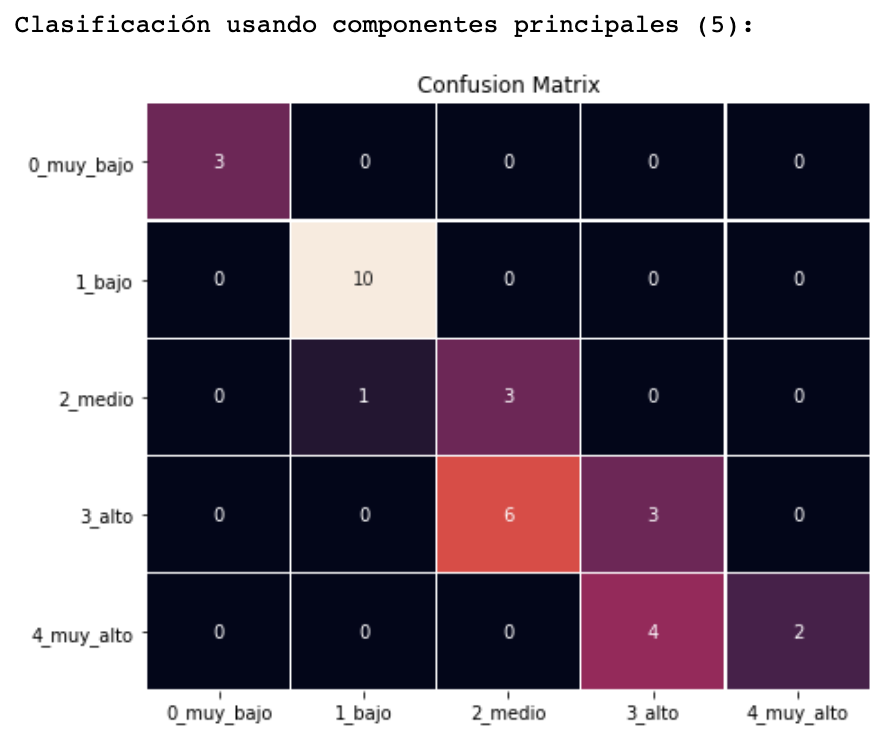
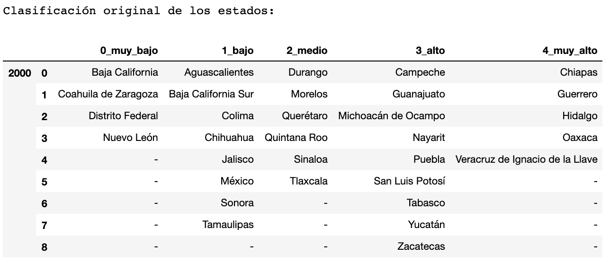
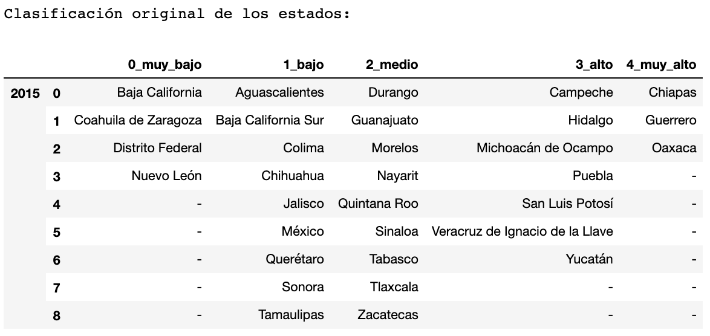
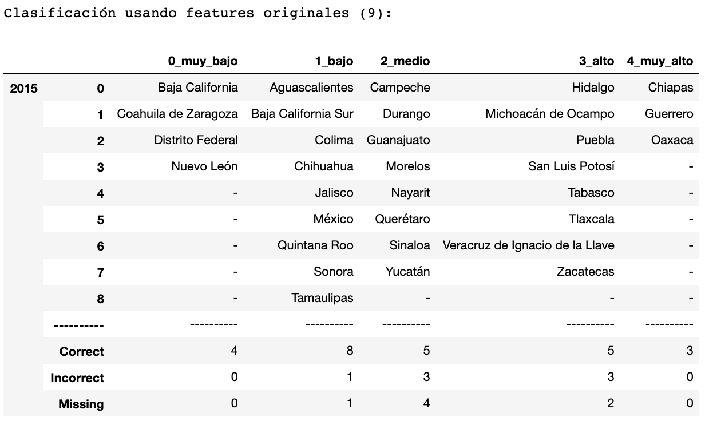
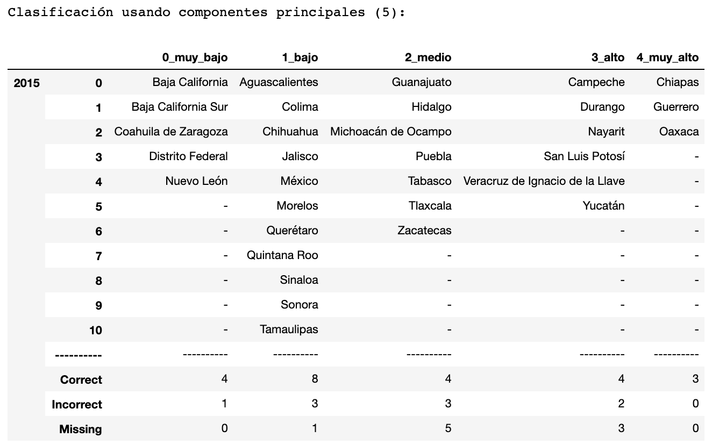
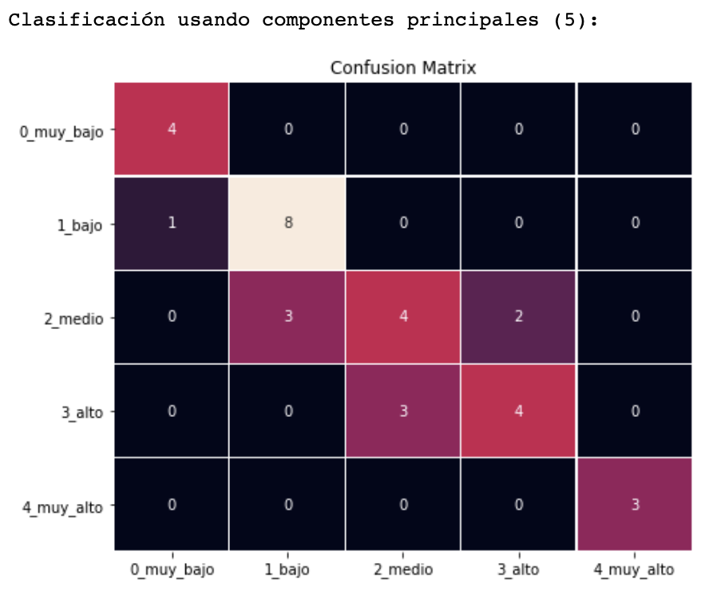

```{r, echo=FALSE, message=FALSE, include=FALSE, warning=FALSE}
require(xaringan)
require(tibble)
require(kableExtra)
```


- Exposición: Roberto Pérez, Iván Salgado
               
- Responder preguntas: Ana Torres

- Hacer preguntas: Carlos López


# Introducción

Usamos análisis de componentes principales para reducir la dimensión de los $9$ indicadores socioeconómicos que forman al índice de marginación de los años 1990, 2000 y 2015. Para realizar esta reducción de dimensiones  utilizamos el método de rotaciones de Jacobi para matrices simétricas. Una vez obtenida la reducción de dimensiones recreamos el índice de marginación del Consejo Nacional de la Población con el primer componente principal. Además se realizarán agrupaciones por el método de k-medias con las variables originales y las obtenidas por el método de componentes principales.

---

#Índice de marginación

> Desde 1990 el CONAPO emprendió esfuerzos sistemáticos para construir indicadores con el objetivo de         analizar las desventajas sociales de la población e identificar con precisión espacios mayormente           marginados, diferenciándolos según su intensidad de carencias, el resultado fue el índice de                marginación.

El indice de marginación es un parámetro estadístico que contribuye a la identificación de sectores del país que carecen de oportunidades para su desarrollo y de la capacidad para encontrarlas o generarlas.

```{r echo=FALSE,fig.align='center',fig.align='center', fig.height=2}

knitr::include_graphics("img/CONAPO.JPEG")
```

---

## Indicadores socioeconómicos del índice de marginación

- Educación:

    - Porcentaje de población analfabeta

    - Porcentaje de población sin primaria completa

- Vivienda:

    - Porcentaje de ocupantes en viviendas sin agua entubada

    - Porcentaje de ocupantes en viviendas sin drenaje ni servicio sanitario exclusivo

    - Porcentaje de ocupantes en viviendas sin drenaje ni excusado

    - Porcentaje de ocupantes en viviendas con algún nivel de hacinamiento

    - Porcentaje de ocupantes en viviendas sin energía eléctrica

    - Porcentaje de ocupantes en viviendas con piso de tierra

---

- Distribución de la población:

    - Porcentaje de población en localidades con menos de 5,000 habitantes

- Ingresos:

    - Porcentaje de población ocupada con ingresos de hasta dos salarios mínimos

---

# Análisis de componentes principales

Es un método de reducción de dimensiones. Supóngase que existe una muestra con n individuos cada uno con $p$ variables $(X_1, X_2, …, X_p)$, es decir, el espacio muestral tiene $p$ dimensiones. PCA permite encontrar un número de factores subyacentes $(z<p)$ que explican aproximadamente lo mismo que las $p$ variables originales. Cada una de estas $z$ nuevas variables recibe el nombre de componente principal.

El método de PCA permite por lo tanto “condensar” la información aportada por múltiples variables en solo unas pocas componentes. Esto lo convierte en un método muy útil de aplicar previa utilización de otras técnicas estadísticas tales como regresión, clustering, etc..

---

## Construcción de los componentes principales

Cada componente principal se obtiene por combinación lineal de las variables originales. Se pueden entender como nuevas variables obtenidas al hacer una suma ponderada de las variables originales, donde los ponderadores son conocidos como pesos.

Se resuelve un problema de optimización para encontrar el valor de los pesos con los que se maximiza la varianza. Una forma de resolver esta optimización es mediante el cálculo de eigenvectores y eigenvalores de la matriz de covarianzas.

Para calcular los valores y vectores propios de nuestros datos utilizamos el método de rotaciones de Jacobi para matrices simétricas. Implementamos dos funciones, en donde la primera función nos presentaba la matriz de los valores propios en la diagonal y la segunda función nos proporcionaba la matriz de eigenvectores $Q_k$. 

---

# Implementación

En nuestro caso contamos con $9$ variables correspondientes a los indicadores socioeconómicos. El primer paso que realizamos fue escalar las variables, para después obtener la matriz de varianzas y covarianzas. 

Después utilizamos la función `compute_Jacobi_iterative()` para diagonalizar la matriz de covarianzas y por último utilizamos la función `compute_Jacobi_egvectors()` para obtener la matriz de vectores propios. 

Unas vez utilizado este método, ordenamos los valores propios de mayor a menor para después obtener de manera ordenada la matriz de vectores propios. Posterormente realizamos la multiplicación de la matriz de vectores propios por la matriz de nuestros valores originales (indicadores socioeconómicos) escalados. 

Este producto de matrices nos dará la matriz de componentes principales siendo estos nuestras nuevas variables. 

---

# Año 1990 


La función  `compute_Jacobi_iterative()` nos da la siguiente matriz:

```{r, echo=FALSE, message=FALSE, warning=FALSE}

kable(tibble(read.csv("data/Diagonal_1990.csv")))
```

---

## Matriz de componentes principales

```{r, echo=FALSE, message=FALSE, warning=FALSE}
kable(read.csv("data/PCA_1990.csv")[1:10,1:9])
```
---

## Comparación entre el primer componente y el índice de marginación


```{r, echo=FALSE, message=FALSE, warning=FALSE}
estados<- read.csv('data/Marginacion_1990.csv')
pca <- cbind('Estado' = estados$NOM_ENT, read.csv("data/IM_PCA_1990.csv"))
kable(pca[1:10,])
```

---

## Visualización de dos componentes principales

```{r echo=FALSE,fig.align='center',fig.align='center', fig.height=2}
knitr::include_graphics("img/pca_1990.png")
```

---

# Año 2000


La función  `compute_Jacobi_iterative()` nos da la siguiente matriz:

```{r, echo=FALSE, message=FALSE, warning=FALSE}
kable(tibble(read.csv("data/Diagonal_2000.csv")))
```

---

## Matriz de componentes principales

```{r, echo=FALSE, message=FALSE, warning=FALSE}
kable(read.csv("data/PCA_2000.csv")[1:10,1:9])
```
---

## Comparación entre el primer componente y el índice de marginación


```{r, echo=FALSE, message=FALSE, warning=FALSE}
estados<- read.csv('data/Marginacion_2000.csv')
pca <- cbind('Estado' = estados$NOM_ENT, read.csv("data/IM_PCA_2000.csv"))
kable(pca[1:10,])
```

---

## Visualización de dos componentes principales

```{r echo=FALSE,fig.align='center',fig.align='center', fig.height=2}
knitr::include_graphics("img/pca_2000.png")
```


---

# Año 2015

La función  `compute_Jacobi_iterative()` nos da la siguiente matriz:

```{r, echo=FALSE, message=FALSE, warning=FALSE}
kable(tibble(read.csv("data/Diagonal_2015.csv")))
```

---

## Matriz de componentes principales

```{r, echo=FALSE, message=FALSE, warning=FALSE}
kable(read.csv("data/PCA_2015.csv")[1:10,1:9])
```
---

## Comparación entre el primer componente y el índice de marginación


```{r, echo=FALSE, message=FALSE, warning=FALSE}
estados<- read.csv('data/Marginacion_2015.csv')
pca <- cbind('Estado' = estados$NOM_ENT, read.csv("data/IM_PCA_2015.csv"))
kable(pca[1:10,])
```

---

## Visualización de dos componentes principales

```{r echo=FALSE,fig.align='center',fig.align='center', fig.height=2}
knitr::include_graphics("img/pca_2015.png")
```

---

# Clústering

El aprendizaje no supervisado es un tipo de algoritmo de aprendizaje de máquina usado para extraer inferencias de set de datos carentes de etiquetas respuesta.

```{r echo=FALSE,fig.align='left',fig.align='left', out.width="200px", out.height="150px"}

#knitr::include_graphics("https://media.giphy.com/media/SSirUu2TrV65ymCi4J/giphy.gif")
```

```{r echo=FALSE,fig.align='center',fig.align='center', out.width="200px", out.height="150px"}

knitr::include_graphics("https://media.giphy.com/media/3o6MbbwX2g2GA4MUus/giphy.gif")
```

El clústering tiene como objetivo clasificar observaciones en múltiples grupos basados en su similaridad bajo una métrica específica.

```{r echo=FALSE,fig.align='center',fig.align='center', out.width="200px", out.height="150px"}

knitr::include_graphics("https://media.giphy.com/media/VduFvPwm3gfGO8duNN/giphy.gif")
```


---

# K-medias

El método de $K$-medias para clasificar datos puede ser expresado de la siguiente manera:

```{r echo=FALSE,fig.align='center',fig.align='center', out.width="500px", out.height="100px"}


```

- Donde:
    - $C_k$: se refiere a los $K$ clusters.
    - $\mu_k$: se refiere a los $K$ centroides.
    - $x$: se refiere a los $N$ datos que se clasificarán.

```{r echo=FALSE,fig.align='center',fig.align='center', out.width="250px", out.height="225px"}

knitr::include_graphics("https://thumbs.gfycat.com/SoftEnragedHypsilophodon-size_restricted.gif")
```

---

## Algoritmo

- En términos simplificados, el algoritmo de k-medias se podría simplificar en:
    1. Indicar número de clusters a sacar.
    2. Inicializar centroides.
    3. Asignar observación a su centroide más cercano.
    4. Actualiza los centroides y calcula las nuevas distancias.
    5. Repite los pasos 3 y 4 hasta que no haya cambios significativos o alcances un número máximo de iteraciones.
    
    ```{r echo=FALSE,fig.align='center',fig.align='center', out.width="400px", out.height="300px"}

knitr::include_graphics("https://en.wikitolearn.org/images/en/0/0d/Animation_of_k-means_clustering.gif")
```

---

## Ventajas y desventajas

```{r echo=FALSE,fig.align='left',fig.align='left', out.width="150px", out.height="125px"}

knitr::include_graphics("https://media.giphy.com/media/xUySTHl2WMBJjqD8NW/giphy.gif")
```

- Fortalezas
    1. Algoritmo simple y rápido
    2. Altamente escalable


```{r echo=FALSE,fig.align='left',fig.align='left', out.width="150px", out.height="125px"}

knitr::include_graphics("https://tenor.com/view/beating-mr-burns-bat-smoking-gif-14764352.gif")
```

- Debilidades
    1. Asume conocimiento previo de los datos.
    2. Sensible a valores atípicos
    3. La inicialización de centroides puede tener un gran impacto.
    4. Diferente reacomodo de datos puede dar resultados diferentes.

---

# Resultados finales - 1990

```{r echo=FALSE,fig.align='center',fig.align='center', out.width="400px", out.height="200px"}

knitr::include_graphics("images/1990/1990_base_classif.png")

```

.pull-left[
```{r echo=FALSE,fig.align='left',fig.align='left', out.width="450px", out.height="225px"}

knitr::include_graphics("images/1990/1990_feature_classif.png")

```
]

.pull-right[
```{r echo=FALSE,fig.align='right',fig.align='right', out.width="450px", out.height="225px"}



```
]

---

# Matriz de confusión - 1990

.pull-left[
```{r echo=FALSE,fig.align='left',fig.align='left', out.width="450px", out.height="300px"}

knitr::include_graphics("images/1990/1990_feature_cm.png")

```
]

.pull-right[
```{r echo=FALSE,fig.align='right',fig.align='right', out.width="450px", out.height="300px"}



```
]

---

# Resultados finales - 2000

```{r echo=FALSE,fig.align='center',fig.align='center', out.width="400px", out.height="200px"}



```

.pull-left[
```{r echo=FALSE,fig.align='left',fig.align='left', out.width="600px", out.height="225px"}

knitr::include_graphics("images/2000/2000_feature_classif.png")

```
]

.pull-right[
```{r echo=FALSE,fig.align='right',fig.align='right', out.width="600px", out.height="225px"}

knitr::include_graphics("images/2000/2000_pca_classif.png")

```
]


---

# Matriz de confusión - 2000

.pull-left[
```{r echo=FALSE,fig.align='left',fig.align='left', out.width="450px", out.height="300px"}

knitr::include_graphics("images/2000/2000_feature_cm.png")

```
]

.pull-right[
```{r echo=FALSE,fig.align='right',fig.align='right', out.width="450px", out.height="300px"}

knitr::include_graphics("images/2000/2000_pca_cm.png")

```
]

---

# Resultados finales - 2010

```{r echo=FALSE,fig.align='center',fig.align='center', out.width="400px", out.height="200px"}



```

.pull-left[
```{r echo=FALSE,fig.align='left',fig.align='left', out.width="600px", out.height="225px"}



```
]

.pull-right[
```{r echo=FALSE,fig.align='right',fig.align='right', out.width="600px", out.height="225px"}



```
]

---

# Matriz de confusión - 2010

.pull-left[
```{r echo=FALSE,fig.align='left',fig.align='left', out.width="450px", out.height="300px"}

knitr::include_graphics("images/2010/2010_feature_cm.png")

```
]

.pull-right[
```{r echo=FALSE,fig.align='right',fig.align='right', out.width="450px", out.height="300px"}



```
]

---

# Conclusiones finales

- Los primeros dos componentes principales explicaron aproximadamente el 80% de la varianza.

- El método de clústering logró un desempeño similar al usar los atributos originales y los derivados del PCA. 

- Los componentes principales reducieron la dimensionalidad de los datos casi en un 50% sin comprometer mucho las agrupaciones.

- Las mayores dificultades del algoritmo $K$-medias se presentaron al clasificar los estados con nivel de marginación "medio" y "alto".