```{r setup, include=FALSE}
knitr::opts_chunk$set(echo = TRUE)
```

# Objetivo

Se usará análisis de componentes principales para reducir la dimensión de los $9$ indicadores socioeconómicos que forman al índice de marginación, una vez se tenga la reducción de dimensiones se recreará el índice de marginación del Consejo Nacional de la Población. Además se realizarán agrupaciones por el método de k-medias con las variables originales y las obtenidas por el método de componentes principales.

# Índice de marginación CONAPO

Desde 1990 el CONAPO emprendió esfuerzos sistemáticos para construir indicadores con el objetivo de analizar las desventajas sociales de la población e identificar con precisión espacios mayormente marginados, diferenciándolos según su intensidad de carencias, el resultado fue el índice de marginación.

El indice de marginación es un parámetro estadístico que contribuye a la identificación de sectores del país que carecen de oportunidades para su desarrollo y de la capacidad para encontrarlas o generarlas.

## Indicadores socioeconómicos del índice de marginación

- Educación:

    - Porcentaje de población analfabeta

    - Porcentaje de población sin primaria completa

- Vivienda:

    - Porcentaje de ocupantes en viviendas sin agua entubada

    - Porcentaje de ocupantes en viviendas sin drenaje ni servicio sanitario exclusivo

    - Porcentaje de ocupantes en viviendas sin drenaje ni excusado

    - Porcentaje de ocupantes en viviendas con algún nivel de hacinamiento

    - Porcentaje de ocupantes en viviendas sin energía eléctrica

    - Porcentaje de ocupantes en viviendas con piso de tierra

- Distribución de la población:

    - Porcentaje de población en localidades con menos de 5,000 habitantes

- Ingresos:

    - Porcentaje de población ocupada con ingresos de hasta dos salarios mínimos


# Análisis de componentes principales

## Definición y origen de los componentes principales

Sea $x$ un vector de $p$ variables de donde se desea estudiar la estructura de las covarianzas o correlaciones entre las variables.

El análisis de componentes principales se enfoca en las varianzas de las variables, aunque  no ignora las correlaciones ni covarianzas de estas. El primer paso es obtener una función lineal de la forma $\alpha_{1}^{'}x$ de los elementos de $x$ que explique la varianza máxima, donde $\alpha_1$ es un vector de $p$ constantes $\alpha_{11},\alpha_{12},...,\alpha_{1p}$, es decir:

$$\alpha^{'}_{1}x = \alpha_{11}x_{1} + \alpha_{12}x_{2} + ...  + \alpha_{1p}x_{p} = \sum_{j=1}^{p} \alpha_{1j}x_{j},$$

Después se debe de obtener otra función lineal $\alpha^{'}_{2}x$ no correlacionada con la función $\alpha{1}^{'}x$ que también explique la máxima varianza posible. Así, sucesivamente se irán obteniendo estas funciones lineales hasta obtener la k-ésima función lineal $\alpha^{'}_{k}x$ que al igual que las $k-1$ funciones lineales obtenidas anteriormente, que explique la máxima varianza posible, siendo ésta no correlacionada con $\alpha^{'}_{1}x,\alpha^{'}_{2}x,...\alpha^{'}_{k-1}x$. La $k$-ésima función corresponde al $k$-ésimo componente principal. Se pueden encontrar hasta $p$ componentes principales pero se desea, en general, que la máxima varianza se encuentre en $m$ componentes principales siendo $m \leq p$. El caso más simple es cuando se tienen dos componentes principales, pues las observaciones pueden ser visualizadas en un plano. Cuando se tienen más componentes principales, la visualización de éstos se dificulta. A lo más se pueden visualizar claramente hasta 3 dimensiones, es decir, hasta 3 componentes. Cuando hay más se podrían visualizar planos de nivel pero se perdería la interpretación

Ya definidos los componentes principales, debemos saber como encontrarlos. Consideremos que el vector de variables aleatorias $X$ tiene matriz de covarianzas $\Sigma$ conocida. Esta matriz, cuyo $(i,j)$-ésimo elemento corresponde a la covarianza entre los elementos $i$ y $j$ de $X$ cuando $i\neq j$, cuando $i=j$ el elemento $(i,j) = (i,i)$ corresponde a la varianza. Cuando $\Sigma$ es desconocida, se reemplaza por la matriz $S$.
Para $k=1,2,...,p$ el $k$-ésimo componente principal se define de la forma $z_k = \alpha^{'}_{k}x$, donde $\alpha_k$ es el eigenvector o vector propio de $\Sigma$ correspondiente al $k$-ésimo eigenvalor o valor propio mas grande $\lambda_k$.

Se resuelve un problema de optimización para encontrar el valor de los pesos con los que se maximiza la varianza. Una forma de resolver esta optimización es mediante el cálculo de eigenvector-eigenvalue de la matriz de covarianzas.

## Propiedades de los componentes principales y sus implicaciones

Sea $z$ el vector cuyo $k$-ésimo elemento es $z_k$ correspondiente al $k$-ésimo componente principal para $k=1,2,...,p$ entonces

$$z=A'x,$$

en donde A es la matriz ortogonal cuya $k$-ésima columna, $\alpha_k$, es el $k$-ésimo vector propio de $\Sigma$. Así, los componentes principales son definidos de una transformación lineal ortonormal de $X$.

## ¿Cuántos componentes principales seleccionar?

En esta sección se presentarán las reglas para decidir con cuántos componentes principales se deberían conservar para retener la mayor varianza posible en $x$ (o en las variables estandarizadas $x^*$ en el caso de estudiar componentes principales con la matriz de correlación).

### Porcentaje acumulado de la varianza total

El criterio más común para seleccionar el número de componentes principales es seleccionando el porcentaje acumulado de la varianza total. Normalmente se desea que los componentes principales seleccionados contribuyan entre $80\%$ y $90\%$. El número requerido de componentes principales es el valor más pequeño $m$ para el cual este porcentaje se ha excedido. Este criterio es válido para la matriz de covarianza y correlación.

### Valores propios / Varianzas

Como se ha mencionado anteriormente, los valores propios miden la cantidad de varianza retenida por cada componente principal. Los valores propios son grandes para los primeros componentes principales y pequeños para los componentes subsecuentes. Esto es debido a que los primeros componentes corresponden a las direcciones con la máxima varianza en el conjunto de datos.

Los valores propios pueden ser usados para determinar el número de componentes principales:

- Un valor propio $>1$ indica que el componente principal considera más varianza que la que considera la variable original estandarizada. Esto es utilizado como punto de corte para retener los componentes principales cuyos valores propios sean mayor a 1. Esto es cierto solamente cuando los datos están estandarizados.


Desafortunadamente no hay forma objetiva para decidir cuántos componentes principales son suficientes. Esto depende de cada conjunto de datos con el que se esté trabajando. En la práctica, se tiende a analizar los primeros componentes principales para encontrar patrones interesantes en los datos.

### Estandarización de los datos

En el análisis de componentes principales las variables se suelen escalar (estandarizar). Esto es recomendable cuando las variables son medidas en diferentes escalas, si no se realiza la estandarización, los resultados del análisis se verán afectados.
El objetivo es hacer las variables comparables. Generalmente las variables se estandarizan para que éstas cuenten con desviación estándar 1 y media cero. También se recomienda escalar los datos cuando la media y desviación estándar de las variables es muy diferente.

Cuando se escalan las variables, éstas se transforman de la siguiente manera:

$$\frac{x_i-media(x)}{desv(x)},$$

\newpage

# Método de Rotaciones de Jacobi para matrices simétricas

Para este proyecto no usaremos las funciones ya programadas, usaremos el método de rotaciones de Jacobi para aproximar los valores propios y los vectores propios y con estos poder calcular los componentes principales de nuestros datos.

Este método produce una secuencia de transformaciones ortogonales de la forma $J_k^TAJ_k$ con el objetivo de hacer “más diagonal” a la matriz $A \in \mathbb{R}^{n \times n}$.

Si la matriz $A$ es simétrica y $J_0$ es una transformación de Jacobi, entonces el esquema iterativo $A_{k+1}=(J_0J_1...J_k)^TAJ_0J_1...J_k)$ converge a una matriz diagonal en la que se encuentran los eigenvalores de $A$.

El algortimo para matrices simétricas es:

Dados $A$ simétrica y $tol>0$ definimos $A_0=A,Q_0=I_n$, repetimos el siguiente bloque para $K=0,1,2,...$

1) Elegir un par de índices $(idx1,idx2)$

2) Calcular las entradas $cos(\theta)$, $sen(\theta)$ de la matriz de rotación $J_k$.

3) $A_{k+1}= J_k^T A_k J_k$

4) $Q_{k+1} = Q_{k}J_k$

La matriz $J_k$ se utiliza para eliminar un par de entradas (simétricas) en la matriz $A_k$, esto preserva la simetría de la matriz original. En las columnas de la matriz $Q_k$ se encuentran aproximaciones a los eigenvectores de $A$ y en la diagonal de $A_k$ se tienen aproximaciones a los eigenvalores de $A$.


El método de Jacobi  es conveniente para el cálculo manual o con calculadora, pero en la práctica, en el caso de matrices de grandes dimensiones, la búsqueda del elemento de mayor valor absoluto fuera de la diagonal es muy costosa en tiempo de cálculo, tanto o más que los cálculos de la iteración en sí, por lo que es más conveniente anular los elementos fuera de la diagonal mediante ciclos sistemáticos o barridos.

En el caso de matrices de pequeña dimensión se elimina el elemento de fuera de la diagonal de mayor módulo. Para grandes dimensiones se realiza una eliminación por ciclos. Otra posibilidad es plantear el problema de diagonalizar una matriz compleja de n dimensiones como el de diagonalizar una matriz real de 2n dimensiones.

# K-medias

El clustering de particiones son métodos de agrupamiento para clasificar observaciones en multiples grupos basados en su similaridad bajo una métrica específica. Esta técnica de aprendizaje de máquina cae dentro de la clasificación "no supervisada" debido a que el modelo que realizará las agrupaciones no es entrenado con ejemplos de los grupos objetivo.

$K$-medias es uno de los algoritmos no supervisados de clústering más popular para particionar dados en un conjunto de $k$ grupos, es decir, $k$ clusters. En donde $k$ representa el número de grupos pre especificados por el analista. Éste algoritmo clasifica objetos en múltiples grupos tal que los objetos dentro del mismo grupo son lo más similares posibles (alta similaridad dentro de las clases), mientras que los objetos de diferentes grupos son lo más disimilares posible (baja similaridad entre clases). En $k$ medias, cada cluster es representado por su centro (centroide) el cual corresponde a la media de los puntos asignados a ese grupo.

La idea básica detrás de $k$-medias consiste en definir grupos de tal forma que la variación total dentro de cada grupo (conocida como variación total entre clusters) se minimice.

El método de $K$-medias corresponde a un problema de optimización no-convexo. Dado suficiente tiempo, el método en cuestión tenderá a converger, a pesar de que sea solo a un mínimo local y sus resultados son altamente dependientes de la inicialización de los centroides. El algoritmo de $k$-medias toma un set de datos $X$ compuesto por $N$ puntos como input, así como un parámetro $K$ que especifica el número de clusters a crear. La condición matemática para los $N$ clusters $C_k$ y los $K$ centroides $\mu_k$ se puede expresar de la siguiente manera:

$$ \text{Minimizar } \sum_{k=1} \sum_{\mathrm{x}_n \in C_k} ||\mathrm{x}_n - \mu_k||^2 \text{ con respecto a } C_k \text{ y } \mu_k  $$

## Algoritmo

El método de $k$-medias también es conocido como  *Algoritmo de Lloyd*. Este es un método iterativo que alterna entre dos operaciones:

1. Una vez que un set de centroides $\mu_k$ está disponible, los clusters se actualizan para contener los puntos más cercanos en distancia a cada centroide.

$$  C_k = \{\mathrm{x}_n : ||\mathrm{x}_n - \mu_k|| \leq \mathrm{\,\,all\,\,} ||\mathrm{x}_n - \mu_l||\} $$

2. Dado un set de clusters, los centroides son recalculados con base en la distacia media de todos los puntos que pertenecen al cluster.

$$  \mu_k = \frac{1}{C_k}\sum_{\mathrm{x}_n \in C_k}\mathrm{x}_n $$

Este procedimiento de dos pasos continua hasta que la asignación de clusters y centroides no muestre un cambio significativo (o hasta que se alcance un número límite de iteraciones).

En términos simplificados, el algoritmo de $k$-medias se puede explicar de la siguiente manera:

1. Especificar el número de conglomerados ($k$) a crear (por el analista)

2. Selecciona $k$ objetos del conjunto de datos como los centroides o medias iniciales.
(*Nota: para este proyecto, se hizo uso del método de inicialización de centroides "k-means++" implementado en scikit-learn. Este selecciona puntos del data-set como centroides tomando en cuenta las distancias entre el universo de puntos y dichos centroides.*)

3. Asigna cada observación al centroide más cercano, basado en la distancia euclideana entre el objeto y el centroide.

4. Se actualiza el centroide de cada uno de los $k$ grupos calculando los nuevos valores medios de todas las observaciones en el grupo. El centroide del $k$-ésimo grupo es un vector de tamaño $p$ que contiene las medias de todas las variables para las observaciones que se encuentran en el $k$-ésimo grupo; $p$ es el número de variables.

5. La suma de cuadrados se minimiza iterativamente. Esto es, se iteran los pasos 3 y 4 hasta que la asignación de grupos deje de cambiar o hasta que se cumpla el número máximo de iteraciones.


## Ventajas y desventajas de k-medias

$K$-medias es un algoritmo simple y rápido. Puede trabajar eficientemente con grandes conjuntos de datos. Sin embargo, existen ciertas desventajas, incluyendo:

- Asume conocimiento previo de los datos y requiere que el analista elija el número apropiado de grupos.

- Los resultados finales son sensibles a la selección inicial aleatoria de centroides. Esto es un problema debido a que en cada iteración del algoritmo se seleccionará (con alta frecuencia) diferentes centroides iniciales aunque se esté trabajando con un sólo conjunto de datos. Esto puede dirigir a diferentes resultados de conglomerados en diferentes iteraciones.

- Es sensible con valores atípicos.

-  Si se re acomodan los datos, es posible que se obtenga una solución diferente cada que se ordenen los datos.


\newpage

# Implementación

En primer lugar usamos la función que se desarrolló en la segunda parte de la práctica 1 para aproximar los valores propios y los vecores propios, despues con estos vectores propios se calculan las componenes principales. Ya con los componentes principales creamos nuestro indice con el primer componente.

Se analizaron los indicadores socioeconómicos de los años 1990, 2000 y 2015, realizamos una reducción de dimensiones por medio de análisis de componentes principales. Para poder realizar esto se hizo uso del algoritmo de método de rotaciones de Jacobi estudiado en clase.


      def sign(x):
          """
          Helper function for computing sign of real number x.
          """
          if x >=0:
          return 1
          else:
          return -1

    def compute_cos_sin_Jacobi_rotation(Ak, idx1, idx2):
        """
        Helper function for computing entries of Jacobi rotation.
        Args:
          Ak (numpy ndarray): Matrix of iteration k in Jacobi rotation method.
          idx1 (int): index for rows in Jacobi rotation matrix.
          idx2 (int): index for columns in Jacobi rotation matrix.
        Returns:
          c (float): value of cos of theta for Jacobi rotation matrix.
          s (float): value of sin of theta for Jacobi rotation matrix.
        """
        if np.abs(Ak[idx1,idx2]) > np.finfo(float).eps:
          tau = (Ak[idx2, idx2] - Ak[idx1, idx1])/(2*Ak[idx1, idx2])
          t_star = sign(tau)/(np.abs(tau) + np.sqrt(1+tau**2))
          c = 1/np.sqrt(1+t_star**2)
          s = c*t_star
        else: #no rotation is performed
          c = 1
          s = 0
        return (c,s)


    def compute_Jacobi_rotation(Ak, idx1, idx2):
      """
      Compute Jacobi rotation matrix.
      Args:
          Ak (numpy ndarray): Matrix of iteration k in Jacobi rotation method.
          idx1 (int): index for rows in Jacobi rotation matrix.
          idx2 (int): index for columns in Jacobi rotation matrix.
      Returns:
          J (numpy ndarray): Jacobi rotation matrix.
      """
      c,s = compute_cos_sin_Jacobi_rotation(Ak, idx1, idx2)
      m,n = Ak.shape
      J = np.eye(m)
      J[idx1, idx1] = J[idx2, idx2] = c
      J[idx1, idx2] = s
      J[idx2, idx1] = -s
      return J

Para estos tres años se tuvieron que realizar entre 3 y 4 sweeps con las siguientes iteraciones utilizando la matriz de varianzas y covarianzas de las variables estandarizadas:

    (1,2),(1,3),(1,4),(1,5),(1,6),(1,7), (1,8),(1,9),

     (2,3),(2,4),(2,5), (2,6), (2,7), (2,8), (2,9)

     (3,4), (3,5), (3,6), (3,7), (3,9), (3,9),

     (4,5), (4,6), (4,7), (4,8), (4,9),

     (5,6), (5,7), (5,8), (5,9),

     (6,7), (6,8), (6,9),

     (7,8), (7,9),

     (8,9)

Una vez realizados los sweeps obtenemos la matriz A diagonalizada, en esta matriz se encuentran los valores propios de la matriz de covarianzas. Decidimos comparar los valores propios obtenidos por nuestra función con los valores propios obtenidos por la función de `Python np.linalg.eig()`. Observamos que nuestros resultados son aproximadamente iguales a los valores propios proporcionados a la función de `numpy`.

Para obtener la matriz de vectores propios utilizamos la siguiente función:

    def compute_Jacobi_eigenvectors(A, tol, max_sweeps):
      """
      Compute Jacobi rotation matrix.
      Args:
          Ak (numpy ndarray): Matrix of iteration k in Jacobi rotation method.
          tol (float): Tolorance to stop the iteration
          max_sweeps: (int): Maximun number of times the cycle is done.
      Returns:
          Q (numpy ndarray): Matrix that contain A's eigenvectors.
      """
      A_k = A.copy()
      m,n = A_k.shape
      Q = np.eye(m)
      sweeps = 0
      while (off(A_k) > tol*np.linalg.norm(A_k) and sweeps < max_sweeps + 1):
          sweeps += 1
          for i in range(A_k.shape[0]):
              j = i + 1
              for m in range(A_k.shape[0]-i-1):
                  J = compute_Jacobi_rotation(A_k, i, j)
                  A_k = J.T@A_k@J
                  Q = Q @ J
                  j += 1
                
      return Q    


Lo siguiente que realizamos fue ordenar de manera descendente los valores propios, de tal forma que la matriz de vectores propios contenga el vector propio cuyo valor propio es el más alto, y así sucesivamente.
Para la creación de la matriz de PCA realizamos la multiplicación entre la matriz de vectores propios y los datos que contienen a los indicadores socioeconómicos estandarizados. Así obtenemos una matrix de $32x9$.

Posteriormente se analizó la varianza explicada por estas nuevas dimensiones. El porcentaje de varianza explicada se realizó de la siguiente manera en `Python`:


      explained_variances = []
      for i in range (len(eig)):
          explained_variances.append(eig[i]/np.sum(eig))
      print(explained_variances)


Obtuvimos un nuevo índice de marginación con el primer componente principal, y finalmente se interpretó gráficamente el comportamiento de los primeros dos componentes principales coloreados por el grado de marginación. En la siguiente sección del reporte se mostrarán los resultados obtenidos.

Para la clasificación de estos estados se utilizarán K-medias seleccionando 5 grupos que hacen referencia a los grados de marginación `Muy bajo`, `Bajo`, `Medio`, `Alto` y `Muy alto`. Por medio de matrices de confusiones analizaremos elindice creado con la primer componente principal, se desea que estos nuevos componentes agrupen a los estados según su grado de marginación, es decir, parecido a la agrupación de k-medias obtenida por los 9 indicadores socioeconómicos .


La función realizada para este análisis de conglomerados es la siguiente:

    def adding_cluster_feature(df_sel, df_type):
        if df_type == "orig":
        features = original_features
        elif df_type == "pca":
        features = pca_features

        else:
        print("Invalid 'df_type' parameter specified.")
        raise

        feats = [feat for feat in features if
                (features[feat]["feature"] == True) &
                (features[feat]["selected"] == True)
                ]

        print("Features fed for clustering analysis ({}):".format(len(feats)))
        i = 1
        for f in feats:
            print("{}. {}".format(i, f))
            i += 1

        kmeans = KMeans(n_clusters=5)
        df_sel["cluster"] = kmeans.fit_predict(df_sel.loc[:, feats])
        return df_sel

Entre otras funciones auxiliares que nos ayudaron a interpretar estos clusters de manera visual.

\newpage

# Resultados

A continuación se mostrarán los resultados obtenidos de K-medias utilizando los 9 indicadores socioeconómicos en una matriz de confusión. Posteriormente mostraremos los resultados obtenidos de componentes principales como valores propios, matriz de componentes principlaes y una representación visual en dos dimensiones de los componentes principales que suponemos fueron los que mejor agruparon a las 32 observaciones.

## Año 1990

```{r echo=FALSE,fig.align='center',out.width = "500px", out.height="500px"}
knitr::include_graphics("images/1990/1990_base_classif.png")
```

La tabla anterior nos muestra la clasificación dada por el indice de marginación del CONAPO, tenemos 3 estados clasificados como “Muy_bajo”, 10 estados como “Bajo”, 4 como “medio”,  9 como “Alto” y 6 como “muy_alto”.

\newpage

## K-medias utilizando los indicadores socioeconóminos

Ya conocemos el número de grupos que tenemos, por lo que no es necesario experimentar con este. Si formamos grupos con las variables originales obtenemos lo siguiente:

```{r echo=FALSE,fig.align='center',out.width = "500px", out.height="500px"}
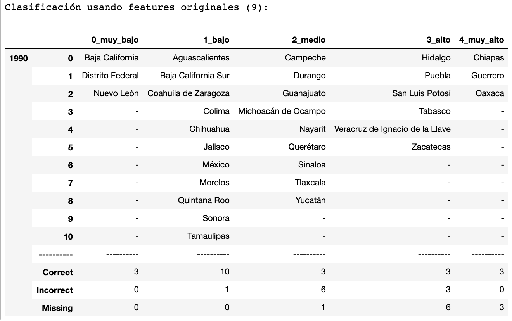
```

Es sencillo ver el desempeño del algoritmo con la tabla agregada, notamos que la clasificación se complica en estados que tienen clasificación de “Medio” a "Muy alto".

## Matriz de confusión
```{r echo=FALSE,fig.align='center',out.width = "500px", out.height="500px"}
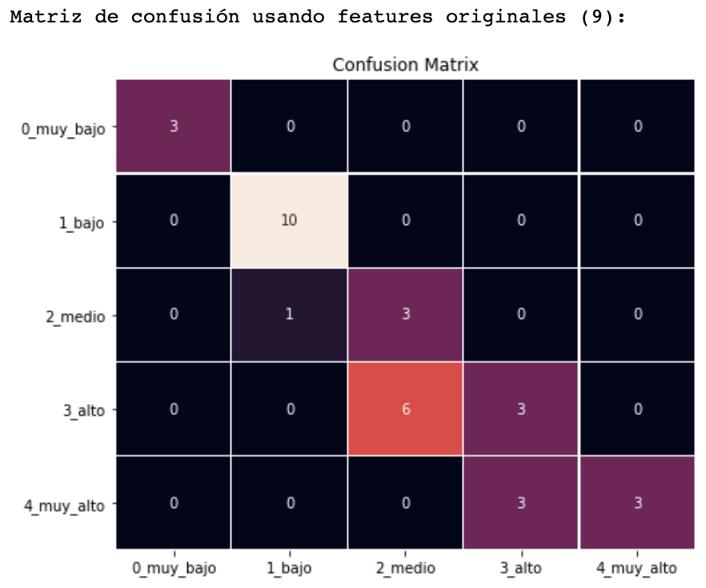
```

Con la matriz de confusión es aun más sencilla observar el desempeño del modelo.


## PCA

### Valores propios

```{r echo=FALSE,fig.align='center',fig.align='center',out.width = "500px", out.height="500px"}
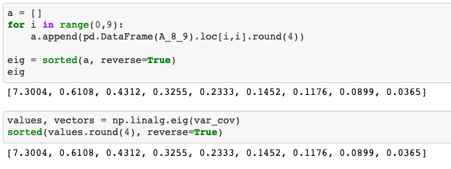
```

Con la imagen anterior notamos que los valores propios obtenidos con la aproximación de Jacobi son muy parecidos a los obtenidos con la función `np.linalg.eig` de numpy.


### Componentes principales

```{r,echo=FALSE}
PCA_1990<-read.csv('data/PCA_1990.csv')
head(PCA_1990, 10)
```

Observamos los primeros 10 valores de cada componente principal, para la construcción del índice solo fue necesario usar la primera componente principal.

### Gráfica dos dimensiones

```{r echo=FALSE,fig.align='center',out.width = "500px", out.height="500px"}
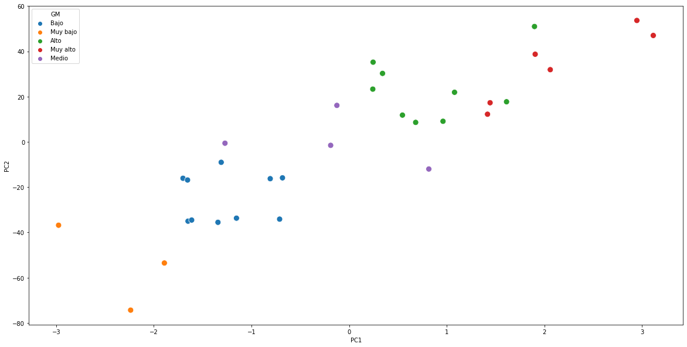
```

Una ventaja de las componentes principales es que nos ayudan a la visualización, podemos pasar de 9 dimensiones a 2 o 3 dimensiones y poder visualizar los datos. Podemos observar que la separación usando las primeras dos componentes es muy buena, ya que podemos apreciar los grados de marginación bien separados. Notamos cierto empalme entre los estados con grado de marginación alto y muy alto.

### K-medias utilizando componentes principales

```{r echo=FALSE,fig.align='center',out.width = "500px", out.height="500px"}
knitr::include_graphics("images/1990/1990_pca_classif.png")
```

Usando componentes principales obtenemos resultados parecidos que con la variables originales, la clasificación sigue sin ser clara en los grupos de “Medio” a “Muy alto”.


### Matriz de confusión

```{r echo=FALSE,fig.align='center',out.width = "500px", out.height="500px"}
knitr::include_graphics("images/1990/1990_pca_cm.png")
```

Al igual que en las variables originales los grupos que se forman con una clasificación de “Muy bajo” y “Bajo” estan mejor definidos que los grupos de de las clasificaciones restantes.

\newpage

## Año 2000

```{r echo=FALSE,fig.align='center',out.width = "500px", out.height="500px"}
knitr::include_graphics("images/2000/2000_base_classif.png")
```

Notamos que para el año 2000, el estado de Durango pasó de tener un gardo de marginación "Alto" a un grado "Medio", mientras que Puebla pasó de tener un grado de marginación "Muy alto" a "Alto" y finalmente el estado de Coahuila pasó de tener un gardo de marginación "Bajo" a "Muy bajo".

### K-medias utilizando los indicadores socioeconóminos

```{r echo=FALSE,fig.align='center',out.width = "500px", out.height="500px"}
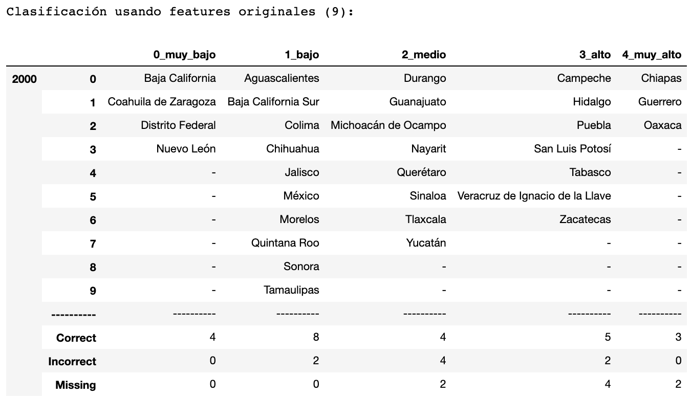
```

Observamos que las tasas de error de agrupación más grandes corresponden a los grados "Medio" y "Alto" seguido del grado "Muy alto". Por otro lado el algoritmo de K-medias agrupó de manera exacta a los 4 estados de la República con los gardos de marginación mas bajos.

### Matriz de confusión

```{r echo=FALSE,fig.align='center',out.width = "500px", out.height="500px"}
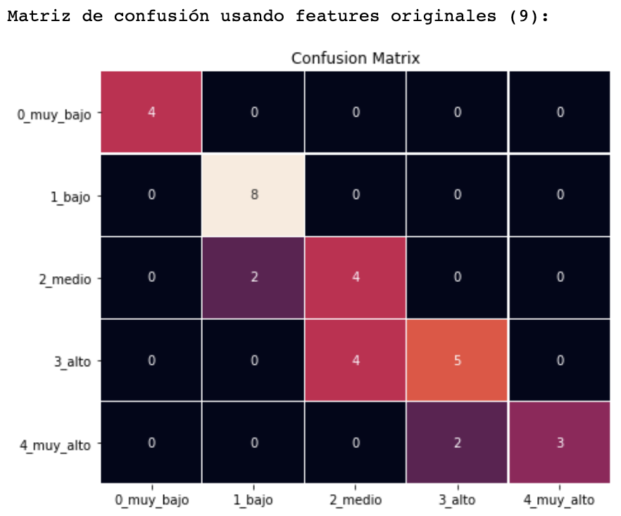
```

Esta matriz de confusión es una manera visual de interpretar el agrupamiento de los estados, la interpretación es la misma a la explicada en la tabla anterior.

\newpage

## PCA

### Valores propios

```{r echo=FALSE,fig.align='center',fig.align='center',out.width = "500px", out.height="500px"}
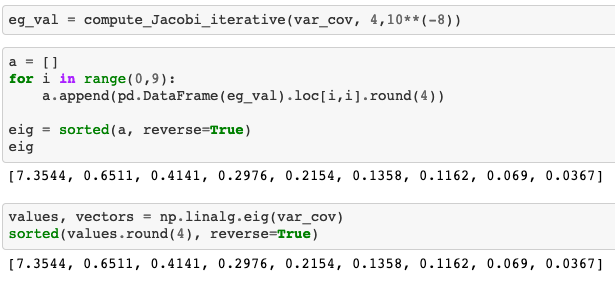
```

Observamos que solamente contamos con un valor propio mayor a uno, si nuestro criterio de selección de componentes a trabajar es por medio de eigen valores  se seleccionaria solamente la primera componente principal.

### Componentes principales

```{r,echo=FALSE}
PCA_2000<-read.csv('data/PCA_2000.csv')
head(PCA_2000)
```

En esta tabla mostramos las primeras cargas de los componentes principales, estos pesos se obtuvieron al realizar el producto de matrices entre la matriz de eigenvectores traspuesta y la matriz con las variables originales escaladas teniendo asi una matriz de 32x9.

### Gráfica dos dimensiones

```{r echo=FALSE,fig.align='center',out.width = "500px", out.height="500px"}
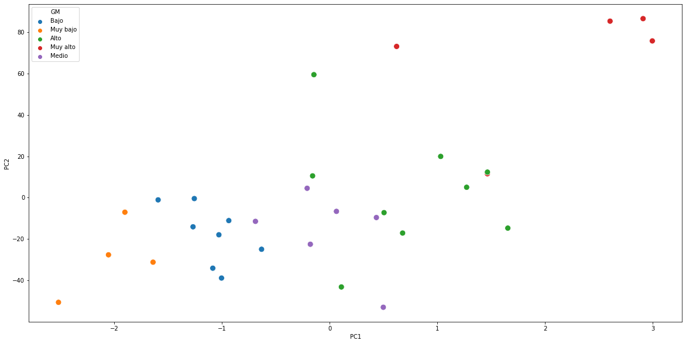
```

Tras un análisis visual de las dos primeras componentes, observamos que los estados con grado de marginación "Muy bajo" y "Bajo" se encuentran bien agrupados, sin embargo notamos que el resto de los grupos no estan tan bien definidos.

### K-medias utilizando componentes principales

```{r echo=FALSE,fig.align='center',out.width = "500px", out.height="500px"}
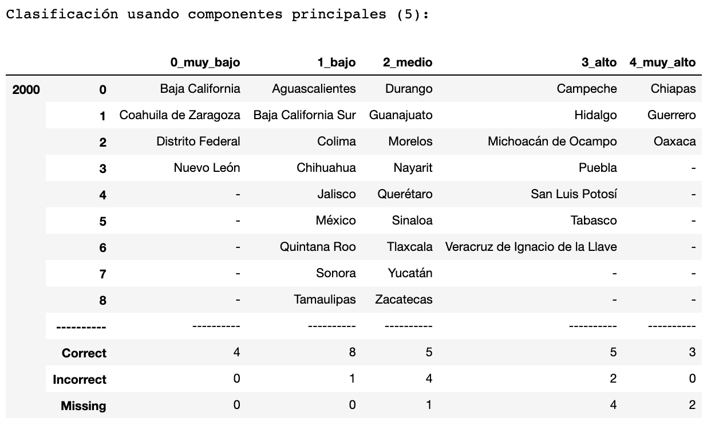
```

Volvemos a utilizar el algoritmo de k-medias para comparar si las clasificaciones de los estados por su grado de marginación presentan tasas de error menores a las tasas obtenidas anteriormente. 
Notamos que el grupo "Alto" fue el que presentó un error de agrupación más alto que el resto de los grupos, seguido del grupo con grado de marginación "Medio". 
Nuevamente, los estados con grado de marginación "Muy bajo" fueron perfectamente agrupados.

### Matriz de confusión

```{r echo=FALSE,fig.align='center',out.width = "500px", out.height="500px"}
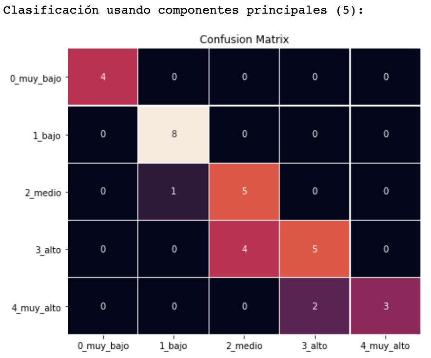
```

Finalmente, interpretamos de manera visual el agrupamiento de los estados utilizando componentes principales y k-medias.

\newpage

## Año 2015

```{r echo=FALSE,fig.align='center',out.width = "500px", out.height="500px"}

knitr::include_graphics("images/2010/2010_base_classif.png")
```

De este año notamos que la mayoría de los estados cuentan con grados de marginación "Medio" y "Alto".
Los estados de Chiapas, Guerrero y Oaxaca han formado parte del grupo cuyos grados de marginación son los más altos durante estos años de estudio.
Del mismo modo, los estados con grado de marginación "Muy bajo" han sido los mismos durante todos estos años.

### K-medias utilizando los indicadores socioeconóminos

```{r echo=FALSE,fig.align='center',out.width = "500px", out.height="500px"}
knitr::include_graphics("images/2010/2010_feature_classif.png")
```


Notamos ahora que la agrupación de estados con un grado de marginación "Medio" fue el grupo que más errores presentó en esta agrupación seguido del grado de marginación "Alto".
Ahora, los grupos de grados de marginación "Muy bajo" y "Muy alto" fueron clasificados de manera correcta según los datos del CONAPO. A continuación podemos ver lo descrito de forma visual.

### Matriz de confusión

```{r echo=FALSE,fig.align='center',out.width = "500px", out.height="500px"}
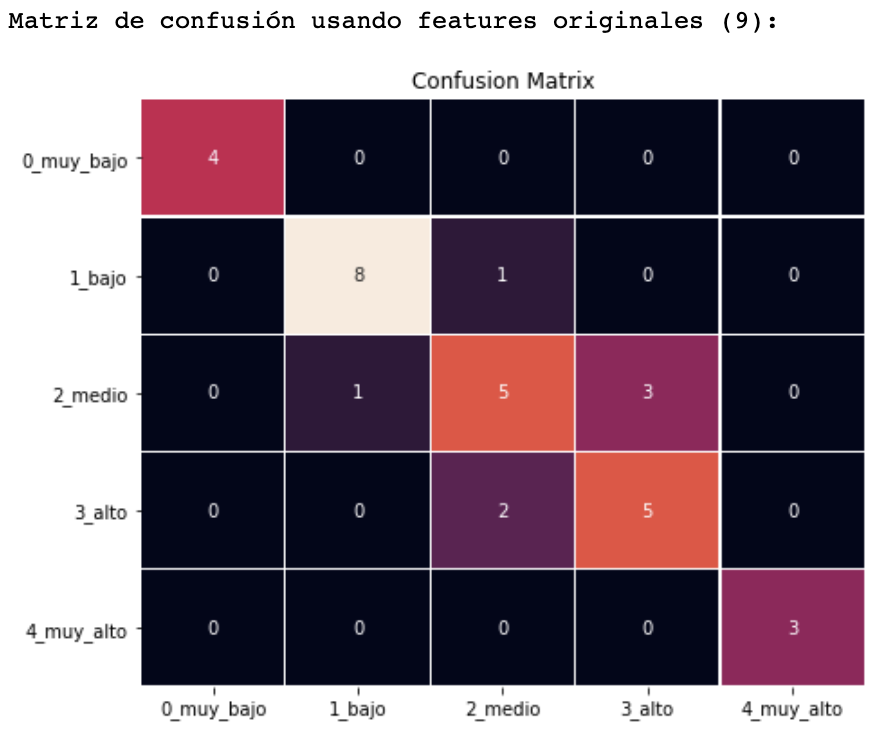
```

## PCA

### Valores propios

```{r echo=FALSE,fig.align='center',fig.align='center',out.width = "500px", out.height="500px"}
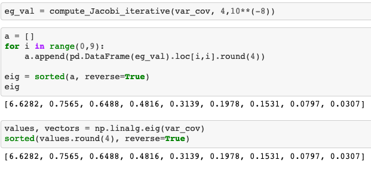
```

Al igual que los años anteriormente estudiados contamos que un eigenvalor mayor a uno, esto también significa que este primer componente principal contiene la mayor proporción de varianza explicada.

### Componentes principales

```{r,echo=FALSE}
PCA_2015<-read.csv('data/PCA_2015.csv')
head(PCA_2015)
```

Observamos los pesos de nuestras nuevas dimensiones, si, si nos quedamos únicamente con el primer componente principal, estos pesos serían nuestros nuevos índices de marginación para los estados.

### Gráfica dos dimensiones


```{r echo=FALSE,fig.align='center',out.width = "500px", out.height="500px"}
knitr::include_graphics("img/pca_2015.png")
```

Durante el estudio de este año se observó que los componentes que "mejor agrupaban" nuestras observaciones eran el segundo y el cuarto, sin embargo notamos el mismo problema que en los años pasados, están bien definidos los grupos, suponemos que para este año tendremos los errores de clasificación más altos

Para este año notamos que la "mejor" agrpación en dos dimensiones la pudimos analizar con el segundo y el cuarto componente principal.

### K-medias utilizando componentes principales

```{r echo=FALSE,fig.align='center',out.width = "500px", out.height="500px"}
knitr::include_graphics("images/2010/2010_pca_classif.png")
```

En efecto, los grupos "Bajo", "Medio" y "Alto" presentan errores de agrupación, siendo el grupo asignado al grado de marginación "medio" el grupo con más error de agrupación.

### Matriz de confusión

```{r echo=FALSE,fig.align='center',out.width = "500px", out.height="500px"}
knitr::include_graphics("images/2010/2010_pca_cm.png")
```

\newpage

# Conclusiones

Notamos que para los tres años que decidimos estudiar los valores propios de la matriz de covarianza de cada año no presentaban cambios drásticos. Los primeros dos componentes principales explicaban aproximadamente el 80% de varianza.

Como se muestra en la sección de resultados, los estados que presentan tasas de error más altas son los clasificados con un grado de marginación medio y alto.

Mientras que los estados con grado de marginación bajo y muy bajo fueron los estados mejor agrupados según el método de k-means, lo anterior tiene sentido pues esto también ocurrió con las variables originales.

Si hubiésemos decidido trabajar solo con los componentes principales cuyos valores propios mayores a uno utilizaríamos este componente princial como nuestro nuevo Índice de marginación, sin embargo, tras este análisis de agrupación por el método de k-medias no notamos una agrupación mejor que la que obtuvimos al realizar este mismo algoritmo con los indicadores socioeconómicos, salvo en casos particulares .


# Referencias

- Kassambara, Alboukadel (2017)  Practical Guide To Principal Component Methods in R: PCA, M (CA), FAMD, MFA, HCPC, factoextra. Volumen 2. STHDA.

- I.T. Jolliffe (2002) Principal Component
Analysis. Second Edition. Volumen 2. Springer.

- CONAPO (2010) Índice de marginación por Entidad Federativa. Consejo Nacional de Población México, DF.

- Scikit-learn developers (2007-2020), 2.3. Clustering, https://scikit-learn.org/stable/modules/clustering.html#k-means.

- Anjua Nagpal (2017), Clustering — Unsupervised Learning, Towards data science, https://towardsdatascience.com/clustering-unsupervised-learning-788b215b074b.

- Huu Le, Anders Eriksson, Thanh-Toan Do, Michael Milford (2018), A Binary Optimization Approach for Constrained K-Means Clustering, Cornell University, https://arxiv.org/abs/1810.10134v2.

- The Data Science Lab (2013), Clustering With K-Means in Python, https://datasciencelab.wordpress.com/2013/12/12/clustering-with-k-means-in-python/.

- David Arthur and Sergei Vassilvitskii (2016), Stanford University, http://ilpubs.stanford.edu:8090/778/1/2006-13.pdf.

- [Notas del curso](https://itam-ds.github.io/analisis-numerico-computo-cientifico/II.computo_matricial/2.3/Algoritmos_y_aplicaciones_de_eigenvalores_eigenvectores_de_una_matriz.html)
